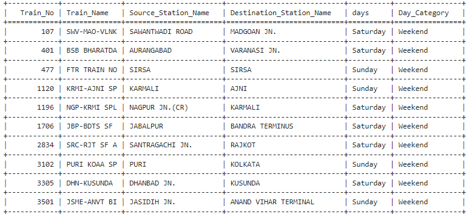
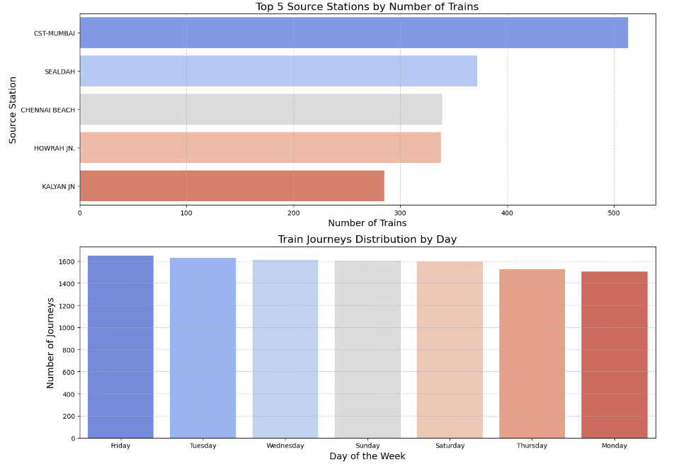

# Project Title :
Railways-Analysis-Report.

## Project Overview :
This Data Engineering project analyzes railway data to provide insights and optimize performance. 
By performing tasks such as data exploration, cleaning, transformation, and advanced analysis, the project aims to reveal patterns and trends that can inform decision-making. 
Based on the data analysis, the final report includes visualizations and recommendations for improving train services.

## Project Highlights :
In this Data Engineering project, we began by loading and inspecting the dataset to understand its structure and address missing values. 
Basic statistics were calculated to determine key metrics like the number of trains and the most common stations, followed by data cleaning to standardize station names.

Next, we filtered the data to focus on trains operating on specific days and created subsets for specific stations. 
We grouped the data by source station to count trains and calculate daily averages, and added a column to categorize trains as 'Weekday' or 'Weekend.'

We then analyzed weekly train patterns using visualizations to spot trends and explored correlations between train frequency and days of the week. 
Finally, we developed various visualizations to represent train frequency and daily distribution and compiled a report summarizing the findings and insights for stakeholders.

